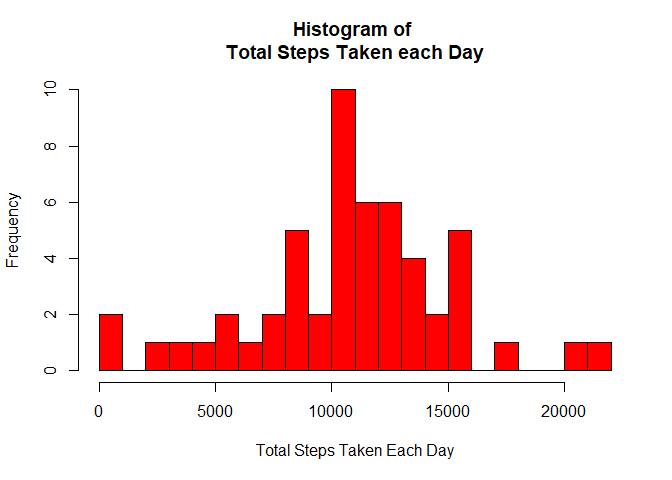
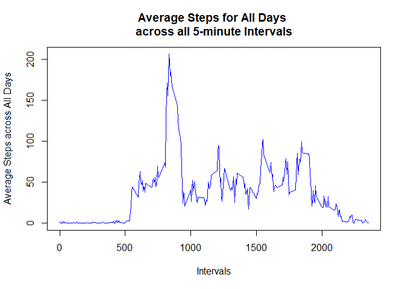
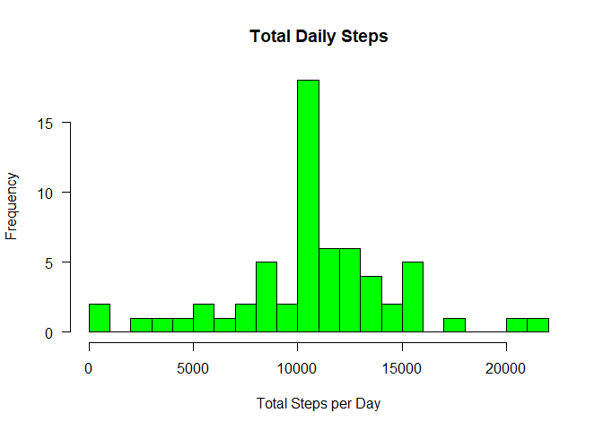
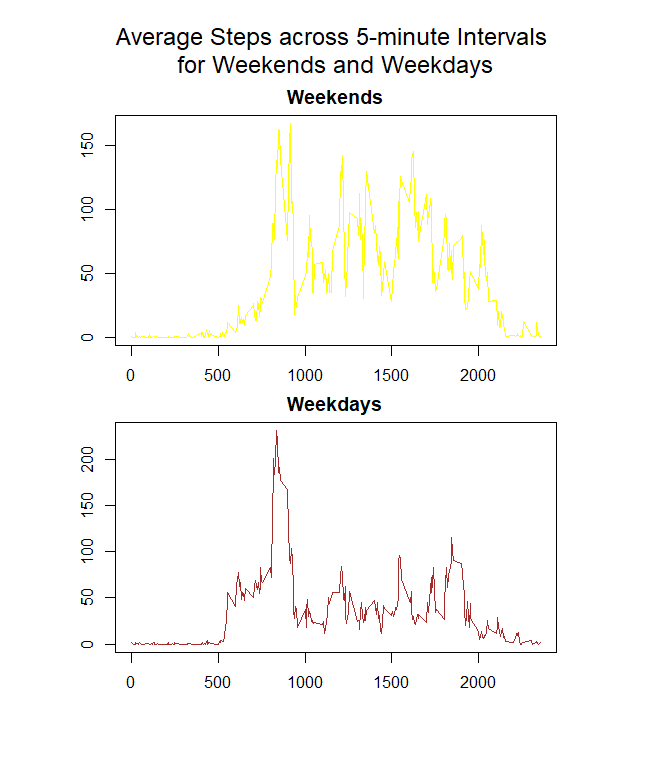

## Loading and PreProcessing the Data
The data is loaded into the "activity" dataset. A second dataset is created without the missing values from the original dataset.


```r
#Loading and Preprocessing the Data
activity <- read.csv("activity.csv", header = TRUE, sep = ",")
activity2 <- na.omit(activity)
```

## Mean Total Number of Steps taken per day
A dataset containing sum of steps per day, across all days, is created. This dataset does not contain missing values. 
A histogram is then plotted to display frequency of the number of steps taken every day, and the mean and median of the data is calculated.


```r
#Total no. of steps each day
daily.steps <- data.frame(dates = unique(activity2$date))
for(i in 1:nrow(daily.steps)){
  daily.steps[i,2] <- sum(activity2[which(activity2$date == daily.steps[i,1]),1])
}
colnames(daily.steps) <- c("date", "total.Steps")

#Plotting
hist(daily.steps$total.Steps, breaks = 20, 
     col = "red", xlab = "Total Steps Taken Each Day", 
     main = "Histogram of \nTotal Steps Taken each Day")
```

<!-- -->

```r
#Mean and Median
mean1 <- mean(daily.steps$total.Steps)
median1 <- median(daily.steps$total.Steps)
print(paste("Mean of Total Steps is", mean1))
```

```
## [1] "Mean of Total Steps is 10766.1886792453"
```

```r
print(paste("Median of Total Steps is", median1))
```

```
## [1] "Median of Total Steps is 10765"
```

## Average Daily Activity Pattern
A dataset is created containing the average (mean) number of steps taken per 5-minute interval, across all the days of the data. Missing values are not accounted for in this dataset.
Then, a graph is plotted for interval vs. average steps per interval. The maximum number of steps for any interval is also calculated, to give an idea about how many steps are taken at which time of the day, every day.


```r
#Average steps across all intervals for all days
interval.Steps <- data.frame(Intervals = unique(activity2$interval))
for(i in 1:nrow(interval.Steps)){
  interval.Steps[i,2] <- mean(activity2[which(interval.Steps[i,1] == activity2$interval),1])
}
colnames(interval.Steps) <- c("intervals", "averagePerInterval")

#Plotting
with(interval.Steps, plot(intervals, averagePerInterval, type = "l", col = "blue", 
                          xlab = "Intervals", ylab = "Average Steps across All Days",
                          main = "Average Steps for All Days \nacross all 5-minute Intervals"))
```

<!-- -->

```r
#Max no. of steps
max2 <- interval.Steps[which.max(interval.Steps$averagePerInterval),1]
print(paste("The 5-minute interval with Maximum No. of Steps is the"," ", max2, "th interval", sep = ""))
```

```
## [1] "The 5-minute interval with Maximum No. of Steps is the 835th interval"
```

## Inputting Missing Values
The missing values from the original dataset are counted, and are replaced by the average (mean) number of steps for that interval, i.e, a NA value for the 50th interval will be replaced by the average number of steps taken in the 50th interval across all the days.
A histogram is plotted for total number of steps taken every day for this data to check if the results vary from earlier data. It is discovered that the mean remains the same, but median changes.


```r
#No. of missing values
missing.activity <- sum(is.na(activity))

#Copy data into new dataset
activity.omitNA <- activity

#Replace NA with mean of 5-minute intervals
for(i in 1:nrow(activity.omitNA)){
  if(is.na(activity.omitNA[i,1]))
    activity.omitNA[i,1] = interval.Steps[which(interval.Steps$intervals == activity.omitNA[i,3]),2]
}

#Total daily steps for each day
daily.steps.omitNA <- data.frame(dates = unique(activity.omitNA$date))
for(i in 1:nrow(daily.steps.omitNA)){
  daily.steps.omitNA[i,2] <- sum(activity.omitNA[which(activity.omitNA$date == daily.steps.omitNA[i,1]),1])
}
colnames(daily.steps.omitNA) <- c("date", "total.Steps")

#Plotting
hist(daily.steps.omitNA$total.Steps, col = "green", breaks = 20, axes = FALSE,
     xlab = "Total Steps per Day", main = "Total Daily Steps")
axis(1)
axis(2, las = 1)
```

<!-- -->

```r
#Mean and Median
mean3 <- mean(daily.steps.omitNA$total.Steps)
median3 <- median(daily.steps.omitNA$total.Steps)
print(paste("Mean of Total Steps is", mean3))
```

```
## [1] "Mean of Total Steps is 10766.1886792453"
```

```r
print(paste("Median of Total Steps is", median3))
```

```
## [1] "Median of Total Steps is 10766.1886792453"
```

## Daywise Activity Patterns
The average number of steps taken per interval, on weekdays vs. on weekends, is calculated. A dataset is created containing average values across all weekdays, and average values across all weekends.
This data is then plotted to check the variance of average number of steps taken at different times of the day, on weekdays vs. on weekends.


```r
#Adding Day column
activity.omitNA$date <- as.Date(as.character(activity.omitNA$date))
activity.omitNA$day <- weekdays(activity.omitNA$date)

#Adding Weekend/Weekday factor variable
activity.omitNA$day.type <- as.factor(ifelse(activity.omitNA$day == "Saturday" | 
                                               activity.omitNA$day == "Sunday", "Weekend", "Weekday"))
for(i in 1:nrow(interval.Steps)){
  interval.Steps[i,3] <- mean(activity.omitNA[which(interval.Steps[i,1] == activity.omitNA$interval & 
                                                      activity.omitNA$day.type == "Weekday"),1])
  interval.Steps[i,4] <- mean(activity.omitNA[which(interval.Steps[i,1] == activity.omitNA$interval & 
                                                     activity.omitNA$day.type == "Weekend"),1])
}
colnames(interval.Steps) <- c("intervals", "averagePerInterval", 
                              "averagePerInterval.Weekdays", "averagePerInterval.Weekends")

#Plotting
par(mfrow = c(2,1), oma = c(4,4,4,4), mar = c(2,2,2,2))
with(interval.Steps, {
  plot(intervals, averagePerInterval.Weekends, type = "l", col = "yellow", 
       xlab = "Intervals", ylab = "Average Steps", main = "Weekends")
  plot(intervals, averagePerInterval.Weekdays, type = "l", col = "brown", 
       xlab = "Intervals", ylab = "Average Steps", main = "Weekdays")
})
mtext("Average Steps across 5-minute Intervals \nfor Weekends and Weekdays", outer = TRUE, cex = 1.5) 
```

<!-- -->

This is the end of the document. Thank you!
